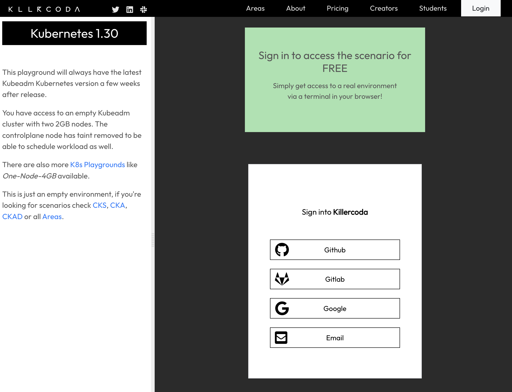
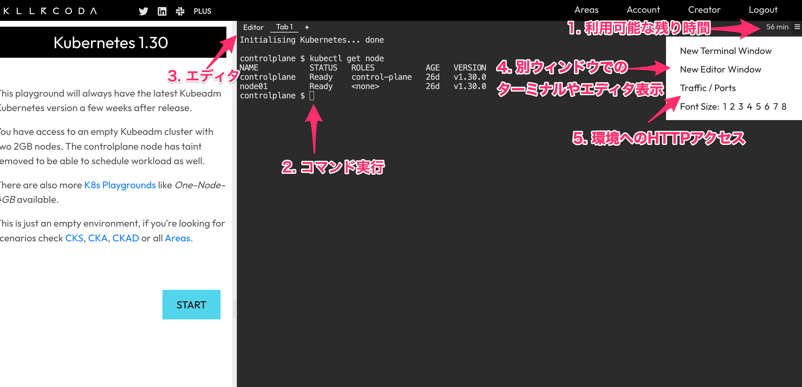
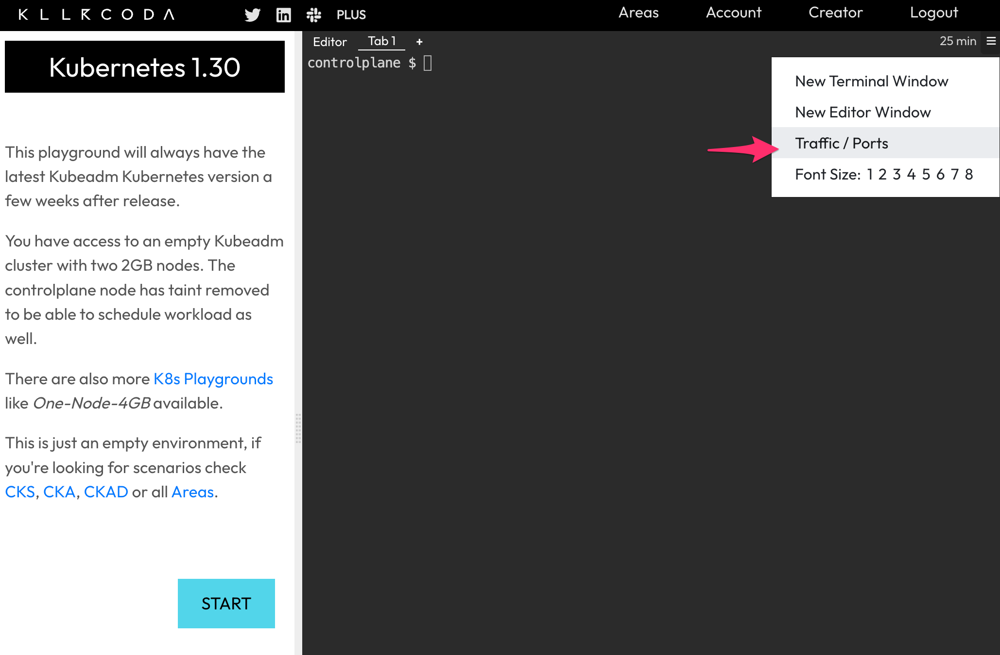
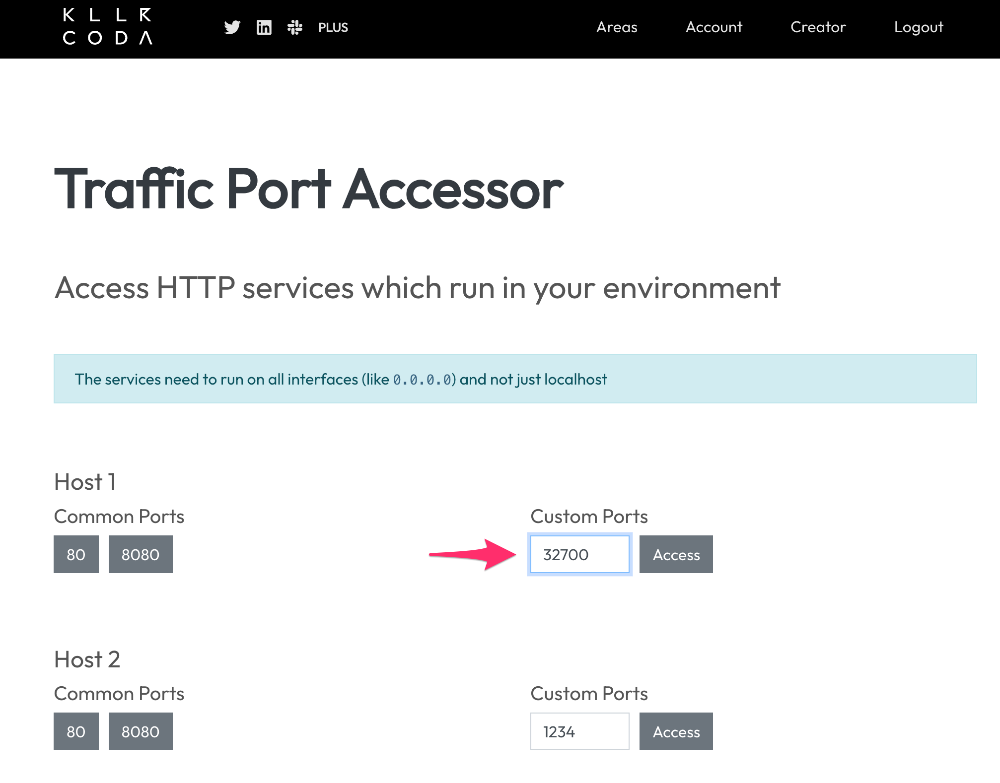
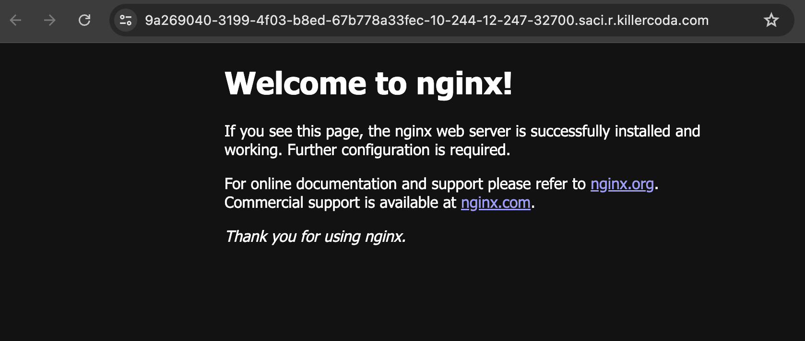

# Lab 0. セットアップ - killercoda編
Kubernetes(K8s)ハンズオンを実施するための事前準備を行います。


killercodaではPyagroundにて


## 1. killercodaでのインスタンス作成

ハンズオンに必要なKubernetesクラスタの作成を行います


1. killercodaにて提供されているKubernetesのPlaygroundにアクセスします

   https://killercoda.com/playgrounds/scenario/kubernetes

2. Github, Google, Emailなどを利用しサインインします

   

3. 完了後、KubernetesClusterが利用可能となります
   簡単に操作画面について解説します。

   | 項目         | 説明           |
   | :------------- | :------------- |
   | 1. 利用可能な残り時間 | 無料プランの場合、60分利用できます |
   | 2. コマンド実行 | ターミナルタブにてコマンドの実行ができます。Kubernetesの操作に必要な各CLIは導入済みです |
   | 3. エディタ | ファイルの操作を便利にするVS Codeのような見た目のエディタです。 |
   | 4. New Window | ターミナルやエディタを別ウィンドウで開けます |
   | 5. Traffic / Ports | 利用している環境上で動かしているアプリへのHTTPアクセスが可能です |

   

4. ターミナルを選択し、ノードが利用可能となっているか確認します
   StatusがReadyになっていればOKです

   ```
   kubectl get node
   ```
   
   実行例：
   ```
   $ kubectl get node
   NAME           STATUS   ROLES           AGE   VERSION
   controlplane   Ready    control-plane   26d   v1.30.0
   node01         Ready    <none>          26d   v1.30.0
   ```

1. KubernetesのVersionを確認

   ```
   kubectl version
   ```

   実行例：
   ```
   $ kubectl version
   Client Version: v1.30.0
   Kustomize Version: v5.0.4-0.20230601165947-6ce0bf390ce3
   Server Version: v1.30.0
   ```


[Lab1](../Lab1)を進めてください。


## Tips, トラブルシュート

### webアプリへのHTTPアクセス

    右上の**Traffic / Ports**にて、Node側のPortを指定してHTTPアクセスができます
    
    実行例：
    
    ```
    # podの作成
    controlplane $ kubectl run nginx --image=nginx
    pod/nginx1 created
    
    # serviceの作成
    controlplane $ kubectl expose pod nginx --port=80 --type NodePort
    service/nginx exposed
    
    # nodePortの確認
    controlplane $ kubectl get svc nginx -o json | jq '.spec.ports[0].nodePort'
    32700
    ```
   右上のメニューからTrafficを選択

   

   Custom PortsにてNodePortのポート番号を入力しAccessをクリック

   

   

   無事にアプリ（Nginx）が表示されました

   

​    

### 1時間経過後

無料プランでは環境は１時間のみ利用できます。１時間経過後はクラスタは削除されます。

左のメニューからStart > Restart をクリックすることで**新たにクラスタ**を作成することは可能です。


