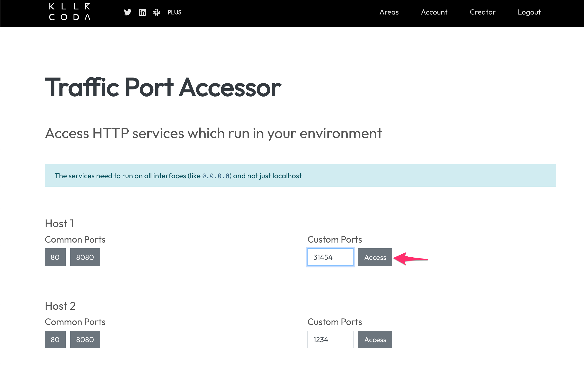
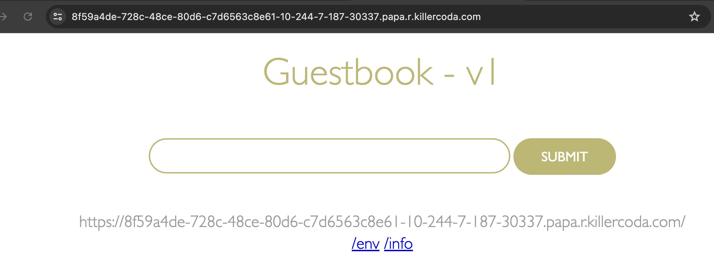
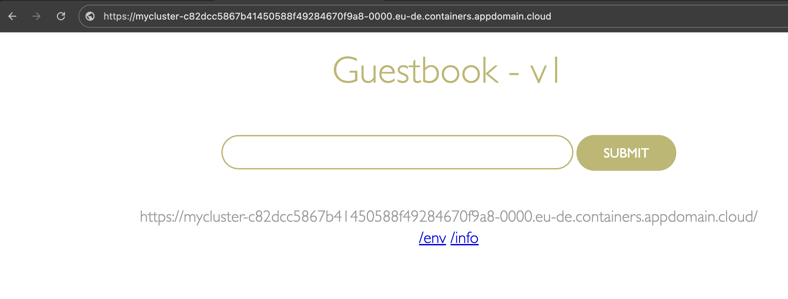

- [Lab 1) Kubernetesクラスターへのアプリケーションデプロイ](#lab-1-kubernetesクラスターへのアプリケーションデプロイ)
  - [1. K8sクラスターへのアプリケーションデプロイ](#1-k8sクラスターへのアプリケーションデプロイ)
  - [2. アプリの公開](#2-アプリの公開)
    - [killercoda編  (NodePortでのサービス公開)](#killercoda編--nodeportでのサービス公開)
    - [IKS編 -  (Ingressでのサービス公開)](#iks編----ingressでのサービス公開)
  - [最後に](#最後に)


# Lab 1) Kubernetesクラスターへのアプリケーションデプロイ


Kubernetesクラスターへのアプリケーションのデプロイ方法を学びます。

Lab1〜3ではWebサイトのゲストブック機能を提供するシンプルなWebアプリケーション(guestbook)を使用します。


## 1. K8sクラスターへのアプリケーションデプロイ
`guestbook` アプリケーションをK8sクラスターにデプロイします。  
使用するアプリは`ibmcom/guestbook:v1` という名前で，ビルド済のDockerイメージがDockerHub上にアップロード済です。


1. `guestbook`を実行します。 `kubectl create deployment guestbook --image=ibmcom/guestbook:v1`

​	実行例:

```bash
$ kubectl create deployment guestbook --image=ibmcom/guestbook:v1
deployment.apps/guestbook created
```


2. デプロイしたアプリのステータスを確認します。
  `kubectl get pods`
  Podのステータスが「実行中(Running)」になったら，OKです。

  実行例：
  ```bash
  $ kubectl get pods
  NAME                         READY   STATUS    RESTARTS   AGE
  guestbook-747778c876-57vrl   1/1     Running   0          14s
  ```

>補足:  
> アプリケーションの実行ステータスを確認してみましょう。
> 
> ```bash
> $ kubectl get pods
> NAME                         READY   STATUS    RESTARTS   AGE
> guestbook-75786d799f-8c8cv   1/1     Running   0          1m
> ```
> 
> コマンド実行直後は，STATUS属性が `ContainerCreating` です。少し待つと実行中を示す`Running`に変わります。READY属性も `0/1`から`1/1`に変わっているはずです。
>    
> createコマンドの実行によって`guestbook`コンテナが内包されている`Pod`が生成されました。ですが生成されたものは，`Pod`だけではなく， K8sでコンテナを上手く管理するための以下のコンポーネントが生成されています。
> 
> - **Pod**: アプリケーションコンテナを内包するK8sリソース
> - **ReplicaSet**: Podのライフサイクル管理をするK8sリソース
> - **Deployment**: Pod/ReplicaSetのライフサイクルを管理するK8sリソース
>  
> 上記のK8sリソースを確認するために以下コマンドを実行します。 (guestbookに関連するPod/ReplicaSet/Deploymentが確認できます)
> 
> ```bash
> $ kubectl get all
> NAME                             READY   STATUS    RESTARTS   AGE
> pod/guestbook-75786d799f-8c8cv   1/1     Running   0          7m
> 
> NAME                 TYPE        CLUSTER-IP   EXTERNAL-IP   PORT(S)   AGE
> service/kubernetes   ClusterIP   172.21.0.1   <none>        443/TCP   14h
> 
> NAME                        DESIRED   CURRENT   UP-TO-DATE   AVAILABLE   AGE
> deployment.apps/guestbook   1         1         1            1           7m
> 
> NAME                                   DESIRED   CURRENT   READY   AGE
> replicaset.apps/guestbook-75786d799f   1         1         1       7m
> ```


## 2. アプリの公開

ワーカーノードのIPを介して外部からアクセスできるようにするために， **Deployment**を**Service**を使用して公開します。
K8sクラスターの外からも`guestbook`にアクセスできるようアプリを外部公開します。


アプリをサービスとして公開する方法として代表的なものは以下の通りです。

- クラスタ内のサービス間の通信: ClusterIP
- クラスタ外部からの直接アクセス: NodePort
- 高可用性、スケーラビリティ: Loadbalancer
- HTTP(S)ベースのサービス、高度なルーティング: Ingress


### killercoda編  (NodePortでのサービス公開)

killercodaではNodePortがサポートされているので、そちらを利用してアプリを公開します


1. 以下の手順で `guestbook` アプリケーションが3000番ポートでLISTENするようにします。

   実行例:

   ```bash
   $ kubectl expose deployment guestbook --type="NodePort" --port=3000
   service/guestbook exposed
   ```

   >補足:
   > - **Service**: K8sリソースの一つです。K8sクラスター内のPod間通信を制御したり，外部からのリクエストを適切なPodにルーティングさせるなどの役割を担います。`Service`の種類には、`NodePort`，`LoadBalancer`，`ClusterIP`などがあります。
   > 
   > 今回はK8sクラスターの単一のワーカーノードのIPアドレスを宛先として外部公開する方法を定義しています。(`--type=NodePort`)

   

2. ワーカー・ノードで`guestbook`アプリを公開しているポート番号を調べるために，Service情報を取得します。

   実行例:

   ```bash
   $ kubectl get service guestbook
   NAME        TYPE       CLUSTER-IP      EXTERNAL-IP   PORT(S)          AGE
   guestbook   NodePort   172.21.90.114   <none>        3000:31454/TCP   17s
   ```

   上記の例では，`<NodePort>` の値は `31454` です。

   >補足:  
   > `3000:31454`の表記は，Podが31454ポートで外部公開され，内部的に3000ポートにフォワードされることを表しています。
   > 外部公開するポート番号は任意に指定することも可能です。指定がない場合、IKSでは30000 〜 32767番のポートが自動的に割り当てられます。

   

3. 実際にアプリにアクセスします

​	2の手順で取得したポート番号（NodePort）を使用してアプリケーションにアクセスします。

​	killercodaの右上メニュから **Traffic / Ports** をクリックします

​	表示された　Traffic Port Accessor　にて　Custom Ports　にポート番号（NodePort）を記載しAccessボタンををクリックします。

​	


以下のような画面が表示されていればOKです。




### IKS編 -  (Ingressでのサービス公開)

IBM Cloud Kubernetes ServiceのVPCクラスターではHTTPSでのセキュアなアプリ公開が行えるIngressが利用できるためそちらで公開します


1. まずはクラスター内でのみ呼び出し可能なサービスを作成します

   実行例: 

   ```bash
   $ kubectl expose deployment guestbook --port=3000
   service/guestbook exposed
   ```

   

2. Serviceが作成できたことを確認します
   TypeがClusterIPとなっていればOKです

   ```bash
   $ kubectl get service guestbook
   NAME        TYPE        CLUSTER-IP     EXTERNAL-IP   PORT(S)    AGE
   guestbook   ClusterIP   172.21.128.8   <none>        3000/TCP   12s
   
   ```

   

3. Clusterに割り当てられたFQDNとSSL証明書が保管されたシークレット名を取得します

   * Ingress Subdomain:              {クラスター名-xxxx}.{リージョン}}.containers.appdomain.cloud
   * Ingress Secret:                 {クラスター名-xxxx}

   

   実行例:

   ```
   # cluster名を定義
   $ CLUSTER_NAME=mycluster
   $ ibmcloud ks cluster get --cluster $CLUSTER_NAME
   
   Retrieving cluster mycluster...
   OK
                                   
   Name:                           mycluster
   ID:                             cqb2r30f0m58ofmkvfg0
   State:                          normal
   Status:                         All Workers Normal
   Created:                        2024-07-16 17:21:31 +0900 (2 weeks ago)
   Resource Group ID:              d9cf5ce5267848f8b033b70c4defca47
   Resource Group Name:            satokota
   Pod Subnet:                     172.17.0.0/18
   Service Subnet:                 172.21.0.0/16
   Workers:                        1
   Worker Zones:                   eu-de-1
   Ingress Subdomain:              mycluster-c82dcc5867b41450588f49284670f9a8-0000.eu-de.containers.appdomain.cloud
   Ingress Secret:                 mycluster-c82dcc5867b41450588f49284670f9a8-0000
   Ingress Status:                 warning
   Ingress Message:                Some Ingress components are in a warning state. To view the state of your Ingress components, run `ibmcloud ks ingress status-report get`.
   Public Service Endpoint URL:    https://c110.eu-de.containers.cloud.ibm.com:31263
   Private Service Endpoint URL:   https://c110.private.eu-de.containers.cloud.ibm.com:31263
   Pull Secrets:                   enabled in the default namespace
   VPCs:                           r010-4dcc2e57-6c72-4645-a131-ae69217ced95
   VPE Gateway:                    https://cqb2r30f0m58ofmkvfg0.vpe.private.eu-de.containers.cloud.ibm.com:31263
   Konnectivity Server URL:        https://cqb2r30f0m58ofmkvfg0.vpe.private.eu-de.containers.cloud.ibm.com:30639
   
   Master      
   Status:     Ready (2 weeks ago)
   State:      deployed
   Health:     normal
   Version:    1.30.2_1525
   Location:   Frankfurt
   URL:        https://c110.eu-de.containers.cloud.ibm.com:31263
   ```

   

4. アプリを公開するためのIngressを作成します

   ```
   cat <<EOF | kubectl apply -f -
   apiVersion: networking.k8s.io/v1
   kind: Ingress
   metadata:
     name: guestbook
   spec:
     tls:
       - hosts:
           - {Ingress Subdomainの値を記載してください}
         secretName: {Ingress Secretの値を記載してください}
     rules:
       - host: {Ingress Subdomainの値を記載してください}
         http:
           paths:
             - path: /
               pathType: Prefix
               backend:
                 service:
                   name: guestbook
                   port:
                     number: 3000
   EOF
   ```

   

   実行例：

   ```
   $ cat <<EOF | kubectl apply -f -
   apiVersion: networking.k8s.io/v1
   kind: Ingress
   metadata:
     name: guestbook
   spec:
     tls:
       - hosts:
           - mycluster-c82dcc5867b41450588f49284670f9a8-0000.eu-de.containers.appdomain.cloud
         secretName: mycluster-c82dcc5867b41450588f49284670f9a8-0000
     rules:
       - host: mycluster-c82dcc5867b41450588f49284670f9a8-0000.eu-de.containers.appdomain.cloud
         http:
           paths:
             - path: /
               pathType: Prefix
               backend:
                 service:
                   name: guestbook
                   port:
                     number: 3000
   EOF
   
   
   ingress.networking.k8s.io/guestbook created
   
   ```

   

5. 実際にアプリにアクセスします

   Ingress Subdomainにアクセスしてみます

   URL例：mycluster-c82dcc5867b41450588f49284670f9a8-0000.eu-de.containers.appdomain.cloud

   

   以下のような画面が表示されていればOKです。
   


> 補足:  
>
> 今回はIngressを利用しましたが、IBM Cloud Kubernetes Service のVPCクラスターでは３つの公開方法をサポートしています
>
> * Ingress
>   * HTTPSにてアクセスを保護した接続
>   * クラスター事に自動的に払い出されたFQDNを利用してアクセスが可能
> * Node Port
>   * NodeのIPを利用したアクセス
>   * VPCを利用したクラスターでは、セキュアな構成を取っており、NodeはPrivateIPのみ付与されます。そのためNodePortを利用する場合は以下２点を考慮する必要があります
>   * アクセス元がIBM Cloudの外部の場合はVPNを利用するなどPrivate IPが呼び出せるようにする
>   * ClusterのSecurity Groupにて、NodePortのPortに対するアクセスを許可する
> * LoadBalancer
>   * VPC Loadbalancerを利用したアクセス
>   * LoadBalancer TypeのServiceを作成した際は自動的にVPCのLoad Balancerがオーダーされ利用可能となるよう構築が行われます


以上でサンプルアプリケーション`guestbook`をK8sクラスター上にデプロイし，外部からアクセス可能な状態にできました。


## 最後に

次のハンズオンはこちら [Lab2](../Lab2/README.md) です。

**Lab2を実施されない場合**は， **Lab1で作成したK8sリソースを以下のコマンドで削除** します。

  ```bash
  1) Deploymentを削除する
  $ kubectl delete deployment guestbook

  1) Serviceを削除する
  $ kubectl delete service guestbook
  # IKSの場合は追加でIngressを削除
  $ kubectl delete ingress guestbook

  1) 確認する
  $ kubectl get pods
  
  ```

